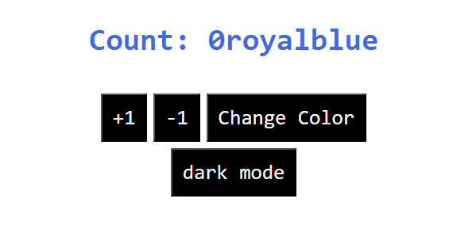
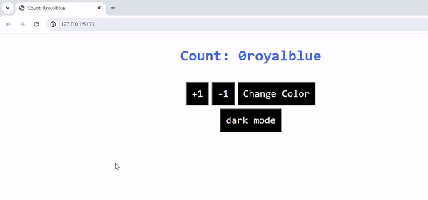

# Todo List

## Date: 14/7/2024

### By: Hussain Al Aradi

#### [Gmail](hussainAlAradi.ha@gmail.com) | [GitHub](https://github.com/HussainALAradi5) | [LinkedIn](https://www.linkedin.com/in/hussainalaradi/)

---

### **_Description_**

#### this is only minor useEffect practice for me😄

---

### **_Technologies Used_**

- JS( as its the languge that i use here)
-React(library )
-CSS
-HTML
-Vite for initilizing the React
---

### **_Getting Started_**

### steps:
#### 1) run "npm i" to install the node_modules to be able to run this nice todo-list
#### 2)run "npm run dev"
#### 3)enjoy😋

---

### **_Screenshots_**

##### image header 1
dark mode is off

dark mode is on

##### image header 2
showcase:
## 

### **_Future Updates_**
- [ ] enhancing the visuals
---

### **_Credits_**

##### my instructors (for give me the idea  to improve my skills)

##### 

---
